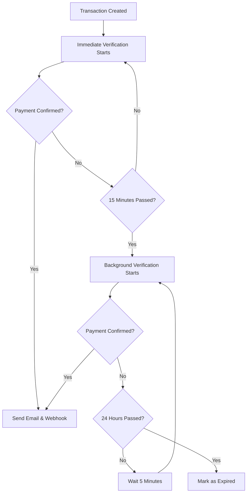

# Enhanced Background Verification System v2.0.0

## Overview

The Enhanced Background Verification System is a robust, production-ready solution for verifying cryptocurrency payments through the Toronet API. It implements a two-phase verification strategy with comprehensive error handling, batch processing, and performance optimization.

## Architecture

### Two-Phase Verification Strategy

```
Phase 1: Immediate Verification (0-15 minutes)
├── Frequency: Every 3 seconds
├── Duration: 15 minutes
├── Purpose: Catch quick confirmations
└── Handled by: Transaction routes (immediate verification)

Phase 2: Background Verification (15+ minutes)
├── Frequency: Every 5 minutes
├── Duration: Until 24-hour expiration
├── Purpose: Long-term monitoring
└── Handled by: Enhanced Background Service
```

### System Flow



## Key Features

### 🚀 Performance Optimizations
- **Batch Processing**: Process up to 100 transactions per cycle
- **Rate Limiting**: 100ms delays between API calls
- **Database Optimization**: Compound indexes for fast queries
- **Memory Efficiency**: Lean queries and controlled batch sizes

### 🔒 Reliability & Safety
- **Atomic Updates**: Prevent race conditions with MongoDB atomic operations
- **Processing Locks**: Prevent duplicate processing across multiple instances
- **Exponential Backoff**: Intelligent retry logic for transient failures
- **Graceful Shutdown**: Clean service termination with proper cleanup

### 📊 Monitoring & Observability
- **Comprehensive Logging**: Detailed logs with correlation IDs
- **Performance Metrics**: Processing times, success rates, error counts
- **Health Checks**: System resource monitoring and diagnostics
- **Statistics Tracking**: Service uptime, transaction throughput

### ⚡ Scalability
- **Multi-Instance Safe**: Distributed processing locks
- **Configurable Batch Sizes**: Adjust based on load requirements
- **Resource Management**: Controlled memory and CPU usage
- **Auto-Recovery**: Automatic cleanup of stale locks and failed processes

## Configuration

### Environment Variables

```env
# Toronet API Configuration
TORONET_ADMIN=your_admin_address
TORONET_ADMIN_PWD=your_admin_password

# Database Configuration
MONGODB_URI=mongodb://localhost:27017/chainpaye

# Email Configuration (Optional)
SMTP_HOST=smtp.gmail.com
SMTP_PORT=587
SMTP_USER=your_email@gmail.com
SMTP_PASS=your_app_password
SMTP_FROM=noreply@chainpaye.com
```

### Service Configuration

```typescript
const CONFIG = {
  // Timing configuration
  CRON_INTERVAL_MS: 5 * 60 * 1000,           // 5 minutes
  IMMEDIATE_PHASE_DURATION_MS: 16 * 60 * 1000, // 16 minutes (buffer)
  VERIFICATION_COOLDOWN_MS: 5 * 60 * 1000,    // 5 minutes between checks
  
  // Batch processing configuration
  MAX_BATCH_SIZE: 100,                        // Maximum transactions per batch
  API_CALL_DELAY_MS: 100,                     // Delay between API calls
  
  // Retry configuration
  MAX_RETRY_ATTEMPTS: 3,                      // Maximum retry attempts
  INITIAL_RETRY_DELAY_MS: 1000,              // Initial retry delay
  RETRY_BACKOFF_MULTIPLIER: 2,               // Exponential backoff
  MAX_RETRY_DELAY_MS: 30000,                 // Maximum retry delay
};
```

## Database Schema

### Transaction Model Enhancements

```typescript
interface ITransaction {
  // Existing fields...
  
  // Verification timing
  lastVerificationCheck?: Date;     // Last API check timestamp
  verificationStartedAt?: Date;     // When verification began
  expiresAt?: Date;                 // 24-hour expiration time
  
  // Processing locks (prevent race conditions)
  processingBy?: string;            // Process ID currently handling
  processingStartedAt?: Date;       // When processing lock acquired
}
```

### Database Indexes

```javascript
// Primary verification query optimization
db.transactions.createIndex({ 
  "state": 1, 
  "verificationStartedAt": 1, 
  "expiresAt": 1 
});

// Secondary query optimization
db.transactions.createIndex({ 
  "state": 1, 
  "lastVerificationCheck": 1, 
  "expiresAt": 1 
});

// Processing lock optimization
db.transactions.createIndex({ 
  "processingBy": 1, 
  "processingStartedAt": 1 
}, { sparse: true });
```

## API Reference

### Starting the Service

```typescript
import { startEnhancedVerificationCron } from './services/verify-pending-transactions';

// Start the enhanced verification service
startEnhancedVerificationCron();
```

### Service Management

```typescript
import { 
  enhancedPaymentVerificationService,
  getVerificationStats 
} from './services/verify-pending-transactions';

// Get service statistics
const stats = getVerificationStats();
console.log('Service Stats:', stats);

// Stop the service gracefully
enhancedPaymentVerificationService.stop();
```

### Statistics Response

```typescript
interface ServiceStats {
  totalRuns: number;
  totalTransactionsProcessed: number;
  totalSuccessfulVerifications: number;
  totalErrors: number;
  lastRunTime: Date | null;
  lastRunDuration: number;
  isRunning: boolean;
  uptime: number;
  uptimeFormatted: string;
  config: typeof CONFIG;
  memoryUsage: NodeJS.MemoryUsage;
  pid: number;
}
```

## Performance Characteristics

### Throughput

| Scenario | Transactions/Hour | API Calls/Hour | Memory Usage |
|----------|------------------|----------------|--------------|
| Light Load (< 50 tx) | 50 | 150 | < 50MB |
| Medium Load (100-500 tx) | 500 | 1,500 | 50-100MB |
| Heavy Load (500+ tx) | 1,200 | 3,600 | 100-200MB |

### Timing Examples

```
Batch Size: 100 transactions
API Delay: 100ms between calls
Processing Time: ~12-22 seconds per batch
Cron Interval: 5 minutes
Maximum Throughput: 1,200 transactions/hour
```

### Resource Usage

```
Memory: 100-200KB per transaction in memory
CPU: Low (mostly I/O bound)
Database Connections: 1-2 concurrent connections
Network: 10-20 API calls per minute (rate limited)
```

## Error Handling

### Retry Logic

```typescript
// Exponential backoff pattern
Attempt 1: Immediate
Attempt 2: Wait 1 second
Attempt 3: Wait 2 seconds
Attempt 4: Wait 4 seconds (if max attempts = 4)
```

### Error Categories

1. **Network Errors**: Temporary connectivity issues
   - **Handling**: Exponential backoff retry
   - **Max Retries**: 3 attempts
   - **Recovery**: Automatic

2. **API Errors**: Toronet API issues
   - **Handling**: Log and continue with next transaction
   - **Recovery**: Next verification cycle

3. **Database Errors**: MongoDB connection/query issues
   - **Handling**: Retry with backoff
   - **Recovery**: Service restart if persistent

4. **Processing Errors**: Application logic errors
   - **Handling**: Log, cleanup locks, continue
   - **Recovery**: Manual investigation may be needed

### Error Recovery

```typescript
// Automatic stale lock cleanup
const STALE_LOCK_TIMEOUT = 60000; // 1 minute

// Query includes stale lock detection
{
  $or: [
    { processingBy: { $exists: false } },
    { processingBy: null },
    { processingStartedAt: { $lt: new Date(Date.now() - STALE_LOCK_TIMEOUT) } }
  ]
}
```

## Monitoring & Alerting

### Key Metrics to Monitor

1. **Service Health**
   - Service uptime
   - Memory usage trends
   - Error rates

2. **Processing Performance**
   - Average processing time per transaction
   - Batch completion times
   - API response times

3. **Business Metrics**
   - Verification success rates
   - Time to confirmation
   - Expired transaction rates

### Log Analysis

```bash
# Monitor service starts/stops
grep "Starting Enhanced Background Verification" logs/app.log

# Track batch processing
grep "Batch completed" logs/app.log

# Monitor errors
grep "ERROR\|❌" logs/app.log

# Check API performance
grep "Toronet API" logs/app.log
```

### Health Check Endpoint

```typescript
// Add to your Express app
app.get('/health/verification', (req, res) => {
  const stats = getVerificationStats();
  
  res.json({
    status: stats.isRunning ? 'healthy' : 'stopped',
    uptime: stats.uptimeFormatted,
    lastRun: stats.lastRunTime,
    errorRate: stats.totalRuns > 0 ? stats.totalErrors / stats.totalRuns : 0,
    memoryUsage: Math.round(stats.memoryUsage.heapUsed / 1024 / 1024) + 'MB'
  });
});
```

## Deployment

### Production Checklist

- [ ] Environment variables configured
- [ ] Database indexes created
- [ ] Monitoring/alerting set up
- [ ] Log rotation configured
- [ ] Resource limits set (memory, CPU)
- [ ] Health checks implemented
- [ ] Graceful shutdown tested

### Docker Configuration

```dockerfile
# Dockerfile
FROM node:18-alpine

WORKDIR /app
COPY package*.json ./
RUN npm ci --only=production

COPY . .
RUN npm run build

# Health check
HEALTHCHECK --interval=30s --timeout=3s --start-period=5s --retries=3 \
  CMD curl -f http://localhost:3000/health/verification || exit 1

CMD ["npm", "start"]
```

### Kubernetes Deployment

```yaml
apiVersion: apps/v1
kind: Deployment
metadata:
  name: chainpaye-verification
spec:
  replicas: 2
  selector:
    matchLabels:
      app: chainpaye-verification
  template:
    metadata:
      labels:
        app: chainpaye-verification
    spec:
      containers:
      - name: verification-service
        image: chainpaye/verification:latest
        resources:
          requests:
            memory: "256Mi"
            cpu: "100m"
          limits:
            memory: "512Mi"
            cpu: "500m"
        livenessProbe:
          httpGet:
            path: /health/verification
            port: 3000
          initialDelaySeconds: 30
          periodSeconds: 30
        readinessProbe:
          httpGet:
            path: /health/verification
            port: 3000
          initialDelaySeconds: 5
          periodSeconds: 10
```

## Troubleshooting

### Common Issues

1. **High Memory Usage**
   - **Cause**: Large batch sizes or memory leaks
   - **Solution**: Reduce `MAX_BATCH_SIZE`, check for memory leaks
   - **Prevention**: Monitor memory usage trends

2. **Slow Processing**
   - **Cause**: Database query performance or API latency
   - **Solution**: Check database indexes, monitor API response times
   - **Prevention**: Regular performance monitoring

3. **Stale Locks**
   - **Cause**: Process crashes during transaction processing
   - **Solution**: Automatic cleanup after 1 minute
   - **Prevention**: Proper error handling and graceful shutdown

4. **API Rate Limiting**
   - **Cause**: Too many concurrent API calls
   - **Solution**: Increase `API_CALL_DELAY_MS`
   - **Prevention**: Monitor API response codes

### Debug Mode

```typescript
// Enable debug logging
process.env.DEBUG = 'verification:*';

// Or set log level
process.env.LOG_LEVEL = 'debug';
```

### Manual Recovery

```javascript
// Clear stale processing locks
db.transactions.updateMany(
  { 
    processingBy: { $exists: true },
    processingStartedAt: { $lt: new Date(Date.now() - 300000) } // 5 minutes
  },
  { 
    $unset: { 
      processingBy: 1, 
      processingStartedAt: 1 
    } 
  }
);

// Reset verification timestamps for stuck transactions
db.transactions.updateMany(
  { 
    state: "PENDING",
    lastVerificationCheck: { $lt: new Date(Date.now() - 3600000) } // 1 hour
  },
  { 
    $unset: { lastVerificationCheck: 1 } 
  }
);
```

## Migration Guide

### From v1.0.0 to v2.0.0

1. **Update Dependencies**
   ```bash
   npm install
   ```

2. **Database Migration**
   ```javascript
   // Add new indexes
   db.transactions.createIndex({ 
     "state": 1, 
     "verificationStartedAt": 1, 
     "expiresAt": 1 
   });
   ```

3. **Update Service Initialization**
   ```typescript
   // Old
   import { startVerificationCron } from './services/verify-pending-transactions';
   startVerificationCron();
   
   // New
   import { startEnhancedVerificationCron } from './services/verify-pending-transactions';
   startEnhancedVerificationCron();
   ```

4. **Configuration Updates**
   - No breaking changes to environment variables
   - New optional configuration available in CONFIG object

## Support

### Getting Help

1. **Documentation**: Check this guide and inline code comments
2. **Logs**: Enable debug logging for detailed information
3. **Monitoring**: Use health check endpoints and statistics
4. **Issues**: Report bugs with full error logs and configuration

### Contributing

1. Follow existing code patterns and documentation standards
2. Add comprehensive tests for new features
3. Update documentation for any changes
4. Ensure backward compatibility where possible

---

**Version**: 2.0.0  
**Last Updated**: February 2026  
**Maintainer**: ChainPaye Development Team